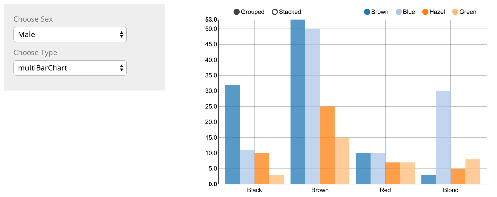

<!-- Limit image width and height -->
<style type='text/css'>
img {
    max-height: 400px;
    max-width: 800px;
}
</style>

<!-- Center image on slide -->
<script src="http://ajax.aspnetcdn.com/ajax/jQuery/jquery-1.7.min.js"></script>
<script type='text/javascript'>
$(function() {
    $("p:has(img)").addClass('centered');
});
</script>

## A D3 chart
```{r echo = F, results = 'asis'}
require(rCharts)
haireye = as.data.frame(HairEyeColor)
n1 <- nPlot(Freq ~ Hair, group = 'Eye', type = 'multiBarChart',
  data = subset(haireye, Sex == 'Male')
)
n1
```

--- &radio
## Quiz

How many lines of code did I write to make this chart?

1. _1_
2. 10
3. 100
4. 1000

*** .hint
I used R not javascript/html/css

*** .explanation
```s
n1 <- nPlot(y ~ x, group, type, data)
```

---
## About Me
- Product Data Scientist at Rally Software
- Before that... Data analyst at two startups in Boulder
- Berore that... Masters in building energy science
- Before that... Mechanical engineer

---
## Who is Rally?


---
## Who is Rally?

- Founded in Boulder
- 11 Years Old
- NYSE: RALY
- Focused on Business Agility 

---
## What I do at Rally
- I work with UX team
- I work with product owners and developer teams
- I work with data engineers and programmers
- I focus on data analytics for our main product

---
## Product Data Hub


---
## Product Data Hub
- Its a full featured bootstrap webpage
- Built with R and Shiny
- Share all data analysis for Product team

--- .segue bg:blue

## Why

---
## Data Product
* Share data analysis with many teams
* Data is always ready for the team
* Less request to 're-run' analysis
* Teams can easily slice and dice data as needed
* Intuitive Navigation
* Help modals to explain details of chart
* Add nice styles and web features
* One place to see everything that matters for a team

--- .segue bg:blue

## What

---
## Product Data Hub


--- .segue bg:blue

## How

---
## Product Data Hub


---
## Build a simple shiny App


---
## ui.R
```{r ui, results = 'hide', tidy = F, message = F}
shinyUI(pageWithSidebar(
  headerPanel("Simple Histogram App"),
  sidebarPanel(
    selectInput(inputId = "n_breaks",
                label = "Number of bins",
                choices = c(10, 20, 25, 30, 50),
                selected = 20
                )
  ),
  mainPanel(
    plotOutput(outputId = "main_plot")
  )
))
```

---
## server.r
```{r server, results = 'hide', tidy = F, message = F}
shinyServer(function(input,output){

  output$main_plot <- renderPlot({  
    hist(faithful$eruptions,
         breaks = as.numeric(input$n_breaks),
         col = "green",
         xlab = "Duration (minutes)")  
  })
})
```


---
## Add Interactive Charts

```{r echo = F, results = 'asis'}
require(rCharts)
haireye = as.data.frame(HairEyeColor)
n1 <- nPlot(Freq ~ Hair, group = 'Eye', type = 'multiBarChart',
  data = subset(haireye, Sex == 'Male')
)
n1
```

---
## Add Interactive Charts

```{r ichart, results = 'hide', tidy = F, message = F}
require(rCharts)
haireye = as.data.frame(HairEyeColor)
n1 <- nPlot(Freq ~ Hair, 
  group = 'Eye',
  data = subset(haireye, Sex == 'Male'),
  type = 'multiBarChart'
)
n1
```

---
## Explore interactive analysis and chart



---
## Check out examples
http://shiny.rstudio.com/gallery/kmeans-example.html


---
## Add more input options
http://shiny.rstudio.com/gallery/widgets-gallery.html


---
## Add more functionality
http://shiny.rstudio.com/reference/shiny/latest/


--- 
## Add navigation
http://shiny.rstudio.com/reference/shiny/latest/


---
## Chose a theme
http://bootswatch.com/


--- 
## Embed other pages


---
## Embed other pages

```{r embed, results = 'hide', tidy = F, message = F, warning=FALSE, error=FALSE}
tabPanel("tableau", includeHTML("tableau_dashboard.html"), align = 'center')
```
- Tableau
- Splunk
- You tube
- Whatever

---
## Resources

Example slide deck http://slidify.github.io/dcmeetup/#1

D3 in slides http://ramnathv.github.io/rCharts/

rCharts http://ramnathv.github.io/rCharts/


