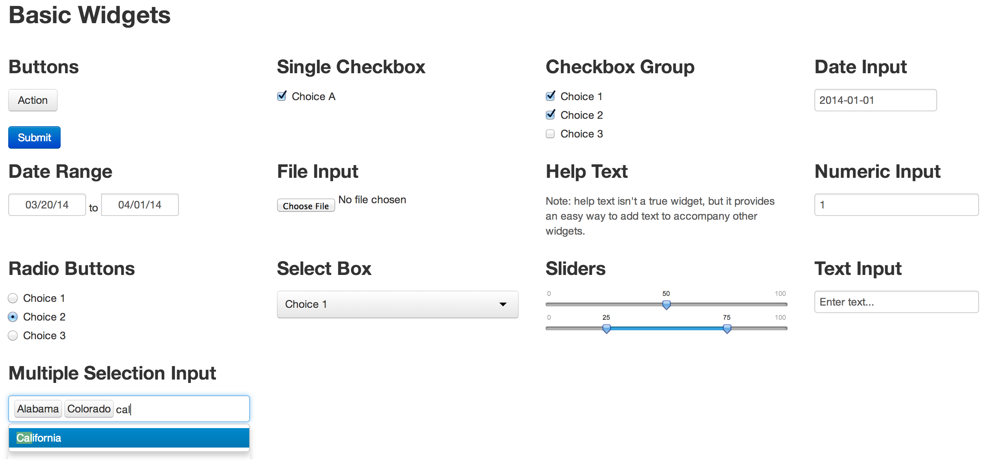
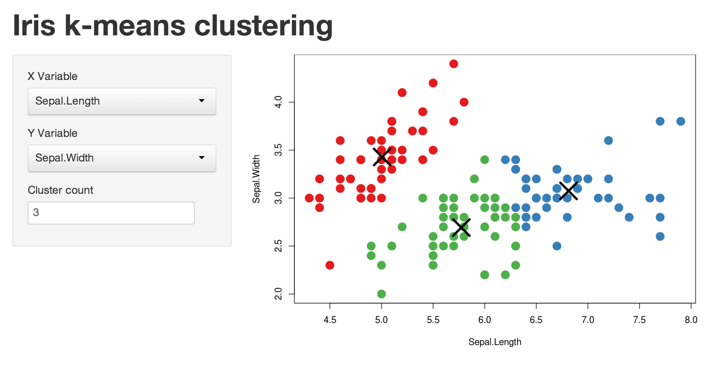

<!-- Limit image width and height -->
<style type='text/css'>
img {
    max-height: 400px;
    max-width: 800px;
}
</style>

<!-- Center image on slide -->
<script src="http://ajax.aspnetcdn.com/ajax/jQuery/jquery-1.7.min.js"></script>
<script type='text/javascript'>
$(function() {
    $("p:has(img)").addClass('centered');
});
</script>

## About Me

---
## Who is Rally
</img>

- Founded in Boulder
- 11 Years Old
- NYSE: RALY
- Focused on Business Agility 

---
## What I do at Rally
> - I’m on the UX team and 
> - I work with Marc Chipouras and the CREAM team
>  - Team of data engineers and programmers
>  - Build and manage the data flow
> - I focus on Data Analytics for the the ALM Product Line.

---
## Data Product
* Share answers with the your teams
* Data is always up to date
* Viewers can choose their view
* Web capabilities


--- &radio
## Question 1

How many lines of code did I write to make this quiz?

1. 1
2. _10_
3. 100
4. 1000

*** .hint
I used R not javascript/html/css

*** .explanation
```S
Question 1

How many lines of code did I ...
write to make this quiz?

1. 1
2. _10_
3. 100
4. 1000

'*** .hint'
I used R not javascript/html/css

'*** .explanation'
This text went here
```

---
## Interactive Chart

<iframe src='
assets/fig/unnamed-chunk-1.html
' scrolling='no' seamless class='rChart 
nvd3
 '
id=iframe-
chart1c351715064f
></iframe>
<style>iframe.rChart{ width: 100%; height: 400px;}</style>

---
## Inputs to the analysis

<div class="row-fluid">
  <div class="span4">
    <form class="well">
      <label class="control-label" for="sex">Choose Sex</label>
      <select id="sex"><option value="Male" selected>Male</option>
<option value="Female">Female</option></select>
      <script type="application/json" data-for="sex" data-nonempty="">{}</script>
      <label class="control-label" for="type">Choose Type</label>
      <select id="type"><option value="multiBarChart" selected>multiBarChart</option>
<option value="multiBarHorizontalChart">multiBarHorizontalChart</option></select>
      <script type="application/json" data-for="type" data-nonempty="">{}</script>
    </form>
  </div>
  <div class="span8">
    <div id="nvd3plot" class="shiny-html-output nvd3 rChart"></div>
  </div>
</div>

---
## Widget Gallery
http://shiny.rstudio.com/gallery/widgets-gallery.html




---
## Example tool with code snipets
http://shiny.rstudio.com/gallery/kmeans-example.html




--- .fill .nobackground
## Embed html easily

```S
tabPanel("tableau", includeHTML("tableau_dashboard.html"), align = 'center')
```


---
## Basic Plot


```r
r1 <- rPlot(mpg ~ wt | am + vs, 
  data = mtcars, 
  color = 'gear',
  type = 'point'
)
r1
```

---

<iframe src='
assets/fig/unnamed-chunk-3.html
' scrolling='no' seamless class='rChart 
polycharts
 '
id=iframe-
chart1c355a43512e
></iframe>
<style>iframe.rChart{ width: 100%; height: 400px;}</style>

---

## Add Controls


```r
r1$addControls("x", "wt", names(mtcars))
r1$addControls("y", "mpg", names(mtcars))
r1
```

---

<iframe src='
assets/fig/unnamed-chunk-4.html
' scrolling='no' seamless class='rChart 
polycharts
 '
id=iframe-
chart1c355a43512e
></iframe>
<style>iframe.rChart{ width: 100%; height: 400px;}</style>

---

## Publish Chart

---
## Resources

Example slide deck http://slidify.github.io/dcmeetup/#1

D3 in slides http://ramnathv.github.io/rCharts/

rCharts http://ramnathv.github.io/rCharts/

test


